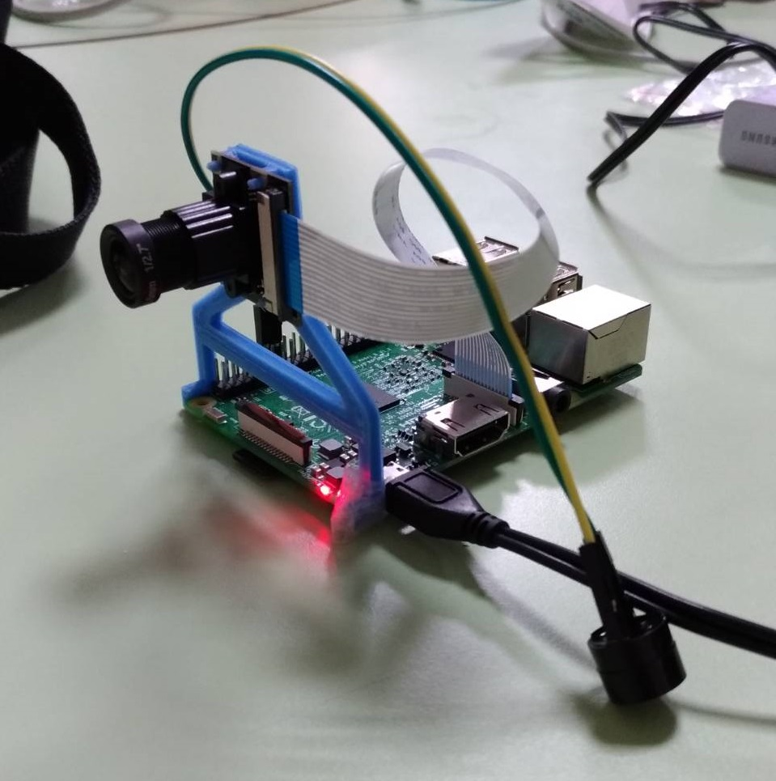

# fang-dau-shi-tung

* [簡介](#intro)
* [功能](#func)
* [材料](#mat)
* [參考資料](#ref)
* [裝置](#dev)
* [執行結果](#res)

<h2 id = "intro"> 簡介 </h2>

簡易防盜系統

<h2 id = "func"> 功能 </h2>

* 偵測場景改變
* 計算物件數量
* 提供網頁即時串流
* 物件數量改變時蜂鳴器發出聲音

<h2 id = "mat"> 材料 </h2>
<table><th>名稱</th><th>數量</th><th>來源</th>
  <tr><td>Pi camera</td><td>1</td><td>Moli</td></tr>
  <tr><td>蜂鳴器</td><td>1</td><td>Moli</td></tr>
  <tr><td>樹莓派</td><td>1</td><td>Moli</td></tr>
  <tr><td>Camera Mount</td><td>1</td><td>Moli 3D列印機</td></tr></table>

<h2 id = "dev"> 裝置 </h2>
* 

<h2 id = "res"> 執行結果 </h2>

<h2 id ="ref"> 參考資料 </h2>

* [Video Streaming with Flask][1]
* [Real time objects counting][2]
* [蜂鳴器][3]
* [Camera Mount][4]

[1]:https://blog.miguelgrinberg.com/post/video-streaming-with-flask
[2]:https://github.com/EmanuelOverflow/object-counting
[3]:https://sites.google.com/site/zsgititit/home/raspberry-shu-mei-pai/raspberry-shi-yong-fengbuzzier
[4]:https://all3dp.com/raspberry-pi-camera-cases-mounts/
